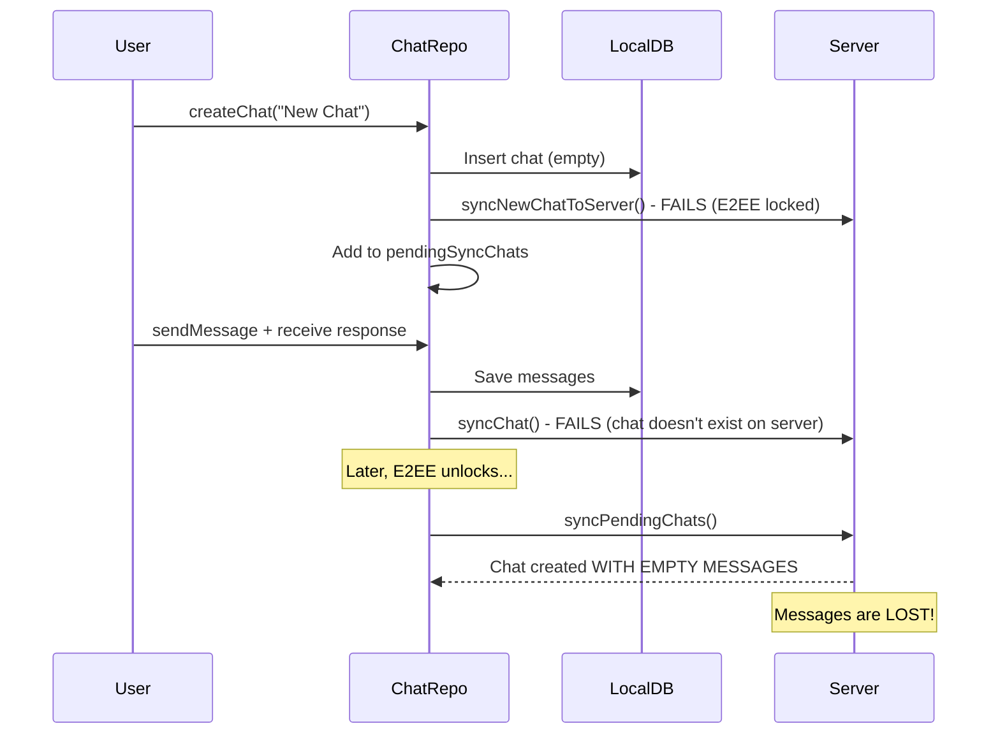

# Fix Notes and Chats Server Sync Issues

## Root Cause Analysis

### Notes Issue

Notes are stored only in memory (`MutableStateFlow<List<Note>>`). There's no local database persistence. When the app closes, all local notes are lost. If `syncNoteToServer()` fails during `createNote()`, the note is added to `pendingSyncNotes`, but this pending list is also in-memory and lost on app restart.

**Key difference from iOS**: iOS doesn't have local storage either, but it ensures sync succeeds before returning. Android creates locally first, then tries to sync asynchronously.

### Chats Issue

The problem is in `syncPendingChats()`:



The issue: `syncPendingChats()` calls `syncNewChatToServer()` which only syncs the **title with empty messages**, not the messages that were added after creation.

## Solution

### Fix 1: Add `isSyncedToServer` Flag to ChatEntity

Add a flag to track whether a chat has been synced to the server.

**File**: [app/src/main/java/chat/onera/mobile/data/local/entity/ChatEntity.kt](app/src/main/java/chat/onera/mobile/data/local/entity/ChatEntity.kt)

```kotlin
@Entity(tableName = "chats")
data class ChatEntity(
    @PrimaryKey
    val id: String,
    val title: String,
    val lastMessage: String?,
    val createdAt: Long,
    val updatedAt: Long,
    val isSyncedToServer: Boolean = false  // NEW
)
```

### Fix 2: Update ChatDao to Query Unsynced Chats

**File**: [app/src/main/java/chat/onera/mobile/data/local/dao/ChatDao.kt](app/src/main/java/chat/onera/mobile/data/local/dao/ChatDao.kt)

Add method:

```kotlin
@Query("SELECT * FROM chats WHERE isSyncedToServer = 0")
suspend fun getUnsyncedChats(): List<ChatEntity>

@Query("UPDATE chats SET isSyncedToServer = 1 WHERE id = :chatId")
suspend fun markAsSynced(chatId: String)
```

### Fix 3: Rewrite `syncPendingChats()` to Include Messages

**File**: [app/src/main/java/chat/onera/mobile/data/repository/ChatRepositoryImpl.kt](app/src/main/java/chat/onera/mobile/data/repository/ChatRepositoryImpl.kt)

- Remove the in-memory `pendingSyncChats` set
- Query unsynced chats from database
- For each unsynced chat:

  1. Get messages from local DB
  2. Call CREATE with all messages (not just empty)
  3. Mark as synced in DB

### Fix 4: Update `createChat()` to Set Sync Status

Set `isSyncedToServer = false` initially, update to `true` when sync succeeds.

### Fix 5: Update `syncChat()` to Handle Unsynced Chats

If the chat is not synced (doesn't exist on server), call CREATE instead of UPDATE.

### Fix 6: Add Database Migration

Increment database version and add migration to add the `isSyncedToServer` column with default value `true` for existing chats (assume they're synced).

## Files to Modify

1. **[ChatEntity.kt](app/src/main/java/chat/onera/mobile/data/local/entity/ChatEntity.kt)** - Add `isSyncedToServer` field
2. **[ChatDao.kt](app/src/main/java/chat/onera/mobile/data/local/dao/ChatDao.kt)** - Add query methods
3. **[AppDatabase.kt](app/src/main/java/chat/onera/mobile/data/local/AppDatabase.kt)** - Add migration
4. **[ChatRepositoryImpl.kt](app/src/main/java/chat/onera/mobile/data/repository/ChatRepositoryImpl.kt)** - Update sync logic
5. **[Chat.kt](app/src/main/java/chat/onera/mobile/domain/model/Chat.kt)** - Add `isSyncedToServer` to domain model (optional)